# LLM Multi-Agent System for Stock Data Processing

A production-ready multi-agent system that uses **GPT-4o-mini** and AWS services for intelligent stock data processing through automated data ingestion, feature engineering, and LLM-powered workflow orchestration.

## � Production Demo Success

✅ **WORKING STATE ACHIEVED** - Complete end-to-end demonstration:
- **715 synthetic stock records** generated and processed
- **AWS Glue ETL jobs** orchestrated by LLM agents
- **376KB of feature-engineered data** produced
- **Professional colorized logging** with loguru
- **Robust error handling** with retry logic

## 🏗️ System Architecture


## 🤖 Agent Architecture

### **Data Ingestion Agent**
- **Function**: Generates synthetic stock data for demo purposes
- **Output**: 715 realistic stock records with OHLCV data
- **Storage**: Uploads to `s3://longhhoang-stock-data-raw/production_demo/`
- **LLM Integration**: GPT-4o-mini validates data quality and structure

### **Data Processing Agent** 
- **Function**: LLM-powered AWS Glue job orchestration
- **Capabilities**: 
  - Intelligent job submission with retry logic
  - Real-time status monitoring
  - Feature engineering coordination
- **Tools**: `SubmitGlueJobTool`, `CheckGlueJobStatusTool`
- **LLM Role**: GPT-4o-mini makes processing decisions using ReAct pattern

### **Feature Engineering Pipeline**
- **Technology**: Apache Spark on AWS Glue
- **Features Created**:
  - Simple Moving Averages (SMA 5, 20)
  - Price change and percentage change
  - 5-day volatility
  - Volume moving averages
  - High/Low ratios
- **Output**: Structured JSON with metadata in S3

## 🛠️ Core Tools & Components

### **Agent Tools (`src/tools/agent_tools.py`)**
```python
# AWS Glue Integration
SubmitGlueJobTool()     # Submit Spark ETL jobs
CheckGlueJobStatusTool() # Monitor job execution

# S3 Management  
S3Manager()             # Upload/download operations
AlphaVantageClient()    # External data source (future)
```

### **Glue ETL Script (`scripts/glue/stock_feature_engineering.py`)**
- **Input**: JSON stock data from S3
- **Processing**: Spark-based feature engineering
- **Output**: Enhanced dataset with technical indicators
- **Monitoring**: CloudWatch integration for job tracking

### **Production Demo (`production_demo.py`)**
```python
class ProductionDemo:
    def generate_large_synthetic_dataset(count)  # Create test data
    def upload_to_s3_production(data)           # S3 upload
    def run_llm_agent_processing(input_path)    # LLM orchestration
    def validate_production_output()            # Verify results
```

## 🚀 Quick Start & Environment Setup

### Prerequisites

1. **Python 3.11+** with Poetry installed
2. **AWS Account** with programmatic access configured
3. **OpenAI API Key** for GPT-4o-mini access
4. **AWS CLI** configured with appropriate permissions

### Step 1: Environment Setup

```bash
# Clone the repository
git clone https://github.com/longhoag/llm-multi-ai-agent-system.git
cd llm-multi-ai-agent-system

# Install dependencies with Poetry
poetry install

# Activate virtual environment
poetry shell
```

### Step 2: AWS Configuration

```bash
# Configure AWS CLI (if not already done)
aws configure

# Create required S3 buckets
aws s3 mb s3://longhhoang-stock-data-raw
aws s3 mb s3://longhhoang-stock-data-processed

# Upload Glue ETL script
aws s3 cp scripts/glue/stock_feature_engineering.py s3://longhhoang-stock-data-raw/scripts/
```

### Step 3: Environment Variables

Create a `.env` file in the project root:

```bash
# OpenAI Configuration
OPENAI_API_KEY=your_openai_api_key_here

# AWS Configuration (optional if using AWS CLI)
AWS_ACCESS_KEY_ID=your_access_key
AWS_SECRET_ACCESS_KEY=your_secret_key
AWS_DEFAULT_REGION=us-east-1

# S3 Bucket Configuration
S3_BUCKET_RAW_DATA=longhhoang-stock-data-raw
S3_BUCKET_PROCESSED_DATA=longhhoang-stock-data-processed

# Logging Configuration
LOG_LEVEL=INFO
```

### Step 4: AWS Glue Job Setup

```bash
# Create the Glue job definition
aws glue create-job \
    --name "stock-feature-engineering" \
    --role "AWSGlueServiceRole" \
    --command '{
        "Name": "glueetl",
        "ScriptLocation": "s3://longhhoang-stock-data-raw/scripts/stock_feature_engineering.py",
        "PythonVersion": "3"
    }' \
    --default-arguments '{
        "--TempDir": "s3://longhhoang-stock-data-raw/temp/",
        "--job-bookmark-option": "job-bookmark-disable"
    }' \
    --max-retries 0 \
    --timeout 60 \
    --max-capacity 2
```

### Step 5: Run the Production Demo

```bash
# Run the complete end-to-end demo
poetry run python production_demo.py
```

Expected output:
```
🎯 LLM-Powered Data Processing Agent - Production Demo
✅ Generated 715 high-quality records  
✅ Upload successful: s3://longhhoang-stock-data-raw/production_demo/daily/PROD/...
✅ Job completed successfully in 120s!
✅ Production validation successful!
🎉 PRODUCTION DEMO COMPLETED SUCCESSFULLY!
```

## 📁 Project Structure

```
llm-multi-ai-agent-system/
├── production_demo.py              # 🎯 WORKING PRODUCTION DEMO
├── scripts/glue/
│   └── stock_feature_engineering.py # Spark ETL job for feature engineering
├── src/
│   ├── tools/
│   │   └── agent_tools.py          # 🔧 AWS Glue & S3 integration tools
│   ├── storage/
│   │   └── s3_manager.py           # S3 operations manager
│   ├── external/
│   │   └── alpha_vantage_client.py # Financial data API client
│   ├── config/
│   │   └── settings.py             # Configuration management
│   ├── workflows/
│   │   └── stock_prediction_workflow.py # LangGraph workflow definitions
│   ├── nodes/
│   │   └── workflow_nodes.py       # Individual agent nodes
│   └── state/
│       └── workflow_state.py       # State management schemas
├── tests/
│   ├── test_langgraph_core.py      # LangGraph workflow tests
│   └── conftest.py                 # Test configuration
├── .github/
│   └── copilot-instructions.md     # 📚 Complete bug fixes documentation
├── pyproject.toml                  # Poetry dependencies with LangGraph
├── README.md                       # 📖 This file
└── .env                           # Environment variables (create this)
```

## 🔧 Core Components Deep Dive

### **LangGraph Integration**
```python
# State-driven workflow orchestration
from langgraph.graph import StateGraph
from langchain_openai import ChatOpenAI

# GPT-4o-mini powered ReAct agents
llm = ChatOpenAI(model="gpt-4o-mini", temperature=0.7)
agent_executor = create_react_agent(llm, tools)
```

### **AWS Glue Tools**
```python
# Submit ETL jobs with retry logic
submit_tool = SubmitGlueJobTool()
result = submit_tool._run(
    job_name="stock-feature-engineering",
    input_path="s3://bucket/input/data.json",
    output_path="s3://bucket/output/processed/",
    symbol="PROD"
)

# Monitor job execution
status_tool = CheckGlueJobStatusTool()
status = status_tool._run(job_name="stock-feature-engineering", run_id=run_id)
```

### **Professional Logging**
```python
# Beautiful colorized logging with loguru
from loguru import logger
import sys

logger.remove()
logger.add(
    sys.stderr,
    colorize=True,
    format="<green>{time:HH:mm:ss}</green> | <level>{level: <8}</level> | <cyan>{message}</cyan>"
)
```

## � Data Flow Architecture

```mermaid
sequenceDiagram
    participant Demo as Production Demo
    participant LLM as GPT-4o-mini Agent
    participant Tools as Agent Tools
    participant S3 as Amazon S3
    participant Glue as AWS Glue
    participant CW as CloudWatch
    
    Demo->>Demo: Generate 715 synthetic records
    Demo->>S3: Upload raw data (0.08 MB)
    
    Demo->>LLM: Request data processing
    LLM->>Tools: submit_glue_job(input_path, output_path)
    Tools->>Glue: Start feature engineering job
    Glue->>CW: Log job execution
    
    loop Monitor Job Status
        LLM->>Tools: check_glue_job_status(run_id)
        Tools->>Glue: Query job status
        Glue-->>Tools: RUNNING/SUCCEEDED/FAILED
        Tools-->>LLM: Status update
    end
    
    Glue->>S3: Write processed data (376 KB)
    Demo->>S3: Validate output files
    Demo->>Demo: ✅ Success! Pipeline complete
```



## 🧪 Testing & Validation

### Run the Production Demo
```bash
# Complete end-to-end test
poetry run python production_demo.py

# Expected results:
# ✅ Data generation: 715 records
# ✅ S3 upload: 0.08 MB uploaded
# ✅ Glue processing: ~120 seconds
# ✅ Output validation: 376 KB processed data
```

### Run Unit Tests
```bash
# All tests
poetry run pytest

# Specific test categories
poetry run pytest tests/test_langgraph_core.py
poetry run pytest -k "glue" -v

# With coverage report
poetry run pytest --cov=src --cov-report=html
```

### Manual Testing Components
```python
# Test individual tools
from src.tools.agent_tools import SubmitGlueJobTool

tool = SubmitGlueJobTool()
result = tool._run(
    job_name="stock-feature-engineering",
    input_path="s3://test-bucket/test-data.json",
    output_path="s3://test-bucket/output/",
    symbol="TEST"
)
print(result)
```

## 🏃‍♂️ Usage Examples

### Basic Production Demo
```python
from production_demo import ProductionDemo
import asyncio

async def main():
    demo = ProductionDemo()
    await demo.run_demo()
    
    # Results:
    # 🎯 LLM-Powered Data Processing Agent - Production Demo
    # ✅ Generated 715 high-quality records
    # ✅ Upload successful
    # ✅ Job completed successfully in 120s!
    # 🎉 PRODUCTION DEMO COMPLETED SUCCESSFULLY!

asyncio.run(main())
```

### Custom LLM Agent Integration
```python
from langchain_openai import ChatOpenAI
from langgraph.prebuilt import create_react_agent
from src.tools.agent_tools import SubmitGlueJobTool, CheckGlueJobStatusTool

# Setup GPT-4o-mini agent with tools
llm = ChatOpenAI(model="gpt-4o-mini", temperature=0.7)
tools = [SubmitGlueJobTool(), CheckGlueJobStatusTool()]
agent = create_react_agent(llm, tools)

# Use agent to process data
result = await agent.ainvoke({
    "input": "Process stock data using AWS Glue job stock-feature-engineering"
})
```

### Direct Tool Usage
```python
from src.tools.agent_tools import SubmitGlueJobTool
import time

# Submit job with retry logic
tool = SubmitGlueJobTool()
max_retries = 3

for attempt in range(max_retries):
    try:
        result = tool._run(
            job_name="stock-feature-engineering",
            input_path="s3://bucket/input/data.json",
            output_path="s3://bucket/output/specific/directory/",
            symbol="AAPL"
        )
        if result.get("success"):
            break
    except Exception as e:
        if "ConcurrentRunsExceededException" in str(e) and attempt < max_retries - 1:
            time.sleep(60)  # Wait before retry
            continue
        raise
```

## 🚨 Known Issues & Solutions

### AWS Glue ConcurrentRunsExceededException
**Problem**: Multiple jobs running simultaneously
**Solution**: Implemented retry logic with 60-second delays

### Empty Path Errors in Glue
**Problem**: Using bucket root as output path
**Solution**: Use specific directory paths: `s3://bucket/specific/directory/`

### Missing Log Colors
**Problem**: Loguru not showing colors
**Solution**: Configure with `sys.stderr` and `colorize=True`

### LangChain Deprecation Warnings
**Problem**: Excessive pydantic v1 warnings
**Solution**: Add warning filters in main application

See `.github/copilot-instructions.md` for complete troubleshooting guide.

## 🛠️ Development & Extension

### Adding New Features
```python
# Create new agent tools
class CustomDataTool(BaseTool):
    name = "custom_data_processor"
    description = "Process custom data formats"
    
    def _run(self, data_path: str, config: dict) -> dict:
        # Implementation here
        return {"success": True, "processed_files": []}
```

### Extending the Pipeline
```python
# Add new processing steps
from langgraph.graph import StateGraph

workflow = StateGraph(WorkflowState)
workflow.add_node("custom_processing", custom_processing_node)
workflow.add_edge("preprocessing", "custom_processing")
workflow.add_edge("custom_processing", "training")
```

### Custom LLM Integration
```python
# Use different LLM models
from langchain_anthropic import ChatAnthropic
from langchain_google import ChatGooglePalm

# Switch to Claude or PaLM
llm = ChatAnthropic(model="claude-3-sonnet-20240229")
# llm = ChatGooglePalm(model="chat-bison-001")
```

## 📈 Monitoring & Observability

### CloudWatch Integration
- **Glue Job Logs**: Automatic logging to CloudWatch Logs
- **Metrics**: Job duration, success/failure rates
- **Alarms**: Set up alerts for job failures

### Application Monitoring
```python
# Built-in performance tracking
from loguru import logger

@logger.catch
def track_performance():
    start_time = time.time()
    # Your processing logic
    duration = time.time() - start_time
    logger.info(f"Processing completed in {duration:.2f}s")
```

### System Health Checks
```python
# Health check endpoints
async def health_check():
    return {
        "status": "healthy",
        "timestamp": datetime.utcnow(),
        "s3_connectivity": await test_s3_connection(),
        "glue_service": await test_glue_service(),
        "llm_service": await test_openai_connection()
    }
```

## 🔐 Security & Best Practices

### AWS IAM Permissions
```json
{
    "Version": "2012-10-17",
    "Statement": [
        {
            "Effect": "Allow",
            "Action": [
                "s3:GetObject",
                "s3:PutObject",
                "s3:ListBucket"
            ],
            "Resource": [
                "arn:aws:s3:::longhhoang-stock-data-*",
                "arn:aws:s3:::longhhoang-stock-data-*/*"
            ]
        },
        {
            "Effect": "Allow",
            "Action": [
                "glue:StartJobRun",
                "glue:GetJobRun",
                "glue:GetJob"
            ],
            "Resource": "*"
        }
    ]
}
```

### Environment Security
- **API Keys**: Never commit to version control
- **AWS Credentials**: Use IAM roles when possible
- **S3 Encryption**: Enable server-side encryption
- **Network**: Use VPC endpoints for AWS services

## 📋 Roadmap & Future Enhancements

### Phase 1: Current (✅ Complete)
- [x] Synthetic data generation
- [x] AWS Glue ETL integration
- [x] LLM-powered job orchestration
- [x] Professional logging and monitoring
- [x] Robust error handling with retries

### Phase 2: Advanced Processing
- [ ] Real-time data ingestion with Kinesis
- [ ] Multiple data source integration (Alpha Vantage, Yahoo Finance)
- [ ] Advanced feature engineering (technical indicators, sentiment analysis)
- [ ] Model training with SageMaker
- [ ] Automated model deployment

### Phase 3: Production Scale
- [ ] Multi-symbol parallel processing
- [ ] Web dashboard for monitoring
- [ ] API endpoints for external integration
- [ ] Kubernetes deployment
- [ ] CI/CD pipeline with GitHub Actions

### Phase 4: Intelligence Enhancement
- [ ] Advanced LLM reasoning for market analysis
- [ ] Automated strategy generation
- [ ] Risk management integration
- [ ] Backtesting framework
- [ ] Performance attribution analysis

## 🤝 Contributing

We welcome contributions! Please follow these guidelines:

### Development Setup
```bash
# Fork and clone the repository
git clone https://github.com/your-username/llm-multi-ai-agent-system.git
cd llm-multi-ai-agent-system

# Install development dependencies
poetry install --with dev

# Install pre-commit hooks
pre-commit install

# Run tests before contributing
poetry run pytest
```

### Contribution Process
1. **Create Feature Branch**: `git checkout -b feature/your-feature-name`
2. **Write Tests**: Add tests for new functionality
3. **Follow Code Style**: Use black, isort, and flake8
4. **Update Documentation**: Update README and docstrings
5. **Submit PR**: Create a pull request with clear description

### Code Quality Standards
- **Testing**: Minimum 80% test coverage
- **Documentation**: All public functions must have docstrings
- **Type Hints**: Use type hints for all function parameters and returns
- **Error Handling**: Implement proper exception handling with logging

## 📞 Support & Resources

### Getting Help
1. **Documentation**: Check `.github/copilot-instructions.md` for detailed patterns
2. **Issues**: Search [GitHub Issues](https://github.com/longhoag/llm-multi-ai-agent-system/issues)
3. **Discussions**: Use GitHub Discussions for questions
4. **Logs**: Check application logs in the console output

### Useful Resources
- **LangGraph Documentation**: [🔗 LangGraph Docs](https://langchain-ai.github.io/langgraph/)
- **AWS Glue Documentation**: [🔗 AWS Glue Guide](https://docs.aws.amazon.com/glue/)
- **OpenAI API Reference**: [🔗 OpenAI Docs](https://platform.openai.com/docs/)
- **Poetry Documentation**: [🔗 Poetry Guide](https://python-poetry.org/docs/)

### Troubleshooting Common Issues
```bash
# AWS credentials not configured
aws configure

# Poetry not found
curl -sSL https://install.python-poetry.org | python3 -

# Dependencies conflict
poetry lock --no-update
poetry install

# Glue job permissions
aws iam attach-role-policy --role-name AWSGlueServiceRole --policy-arn arn:aws:iam::aws:policy/service-role/AWSGlueServiceRole
```

## 📄 License

This project is licensed under the MIT License - see the [LICENSE](LICENSE) file for details.

```
MIT License

Copyright (c) 2025 LLM Multi-Agent System Contributors

Permission is hereby granted, free of charge, to any person obtaining a copy
of this software and associated documentation files (the "Software"), to deal
in the Software without restriction, including without limitation the rights
to use, copy, modify, merge, publish, distribute, sublicense, and/or sell
copies of the Software, and to permit persons to whom the Software is
furnished to do so, subject to the following conditions:

The above copyright notice and this permission notice shall be included in all
copies or substantial portions of the Software.
```

---

## 🎊 Production Ready Status

**✅ SYSTEM IS PRODUCTION READY** 

This system has been thoroughly tested and demonstrates:
- **Reliable data processing** with 715 synthetic records → 376KB processed output
- **Robust error handling** with retry logic for AWS service conflicts  
- **Professional logging** with beautiful colorized output
- **LLM-powered intelligence** using GPT-4o-mini for workflow orchestration
- **Complete AWS integration** with S3 storage and Glue ETL processing

**Ready for real-world deployment and scaling!** 🚀

---

*For the complete technical documentation including all bug fixes and proven patterns, see [`.github/copilot-instructions.md`](.github/copilot-instructions.md)*


